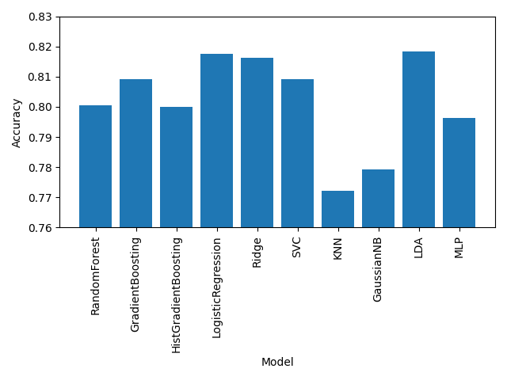

# TelcoCustomerChurn
## 1) Introduction

This project analyzes the Telco Customer Churn dataset, a fictional dataset representing 7,043 telecommunications customers in California during Q3. The dataset contains customer attributes and service usage patterns with the goal of predicting customer churn - identifying which customers are likely to leave so the business can develop targeted retention programs.

The dataset includes 18 features including:
- Customer demographics (gender, SeniorCitizen, Partner, Dependents, tenure)
- Service Subscriptions (Phone Service, Multiple Lines, Internet Service, Online Security, Online Backup, Device Protection, Technical Support, Streaming TV, and Streaming Movies)
- Accounts & Billing (Contract, Paperless Billing, Payment Method, Monthly Charges, Total Charges)

Target Variable: Churn (Yes/No)

Objective: Compare multiple machine learning classifiers to establish a performance baseline, then optimize top-performing algorithms through hyperparameter tuning to develop a final production-ready model for predicting customer churn.

## 2) Data Preprocessing
The raw Telco Customer Churn dataset contains mixed data types requiring preprocessing before model training. The following transformations were applied:

| Step | Transformation | Details |
|------|---------------|---------|
| **Drop identifier** | Remove `customerID` | Unique per customer; no predictive value |
| **Target encoding** | `Churn`: Yes → 1, No → 0 | Binary classification requires numeric labels |
| **Binary encoding** | `gender`: Female → 0, Male → 1; `Partner`, `Dependents`, `PhoneService`, `PaperlessBilling`: Yes/No → 1/0 | Simple binary categorical features |
| **Multi-class encoding** | `MultipleLines`, `InternetService`, `OnlineSecurity`, `OnlineBackup`, `DeviceProtection`, `TechSupport`, `StreamingTV`, `StreamingMovies`, `Contract`, `PaymentMethod` | Converted to integer codes (0, 1, 2, ...) preserving categorical information |
| **Numeric conversion** | `TotalCharges`: string → float | Original format stored as object due to empty strings; coerced errors to NaN and imputed |
| **Feature scaling** | `StandardScaler` applied to `tenure`, `MonthlyCharges`, `TotalCharges` | Required for distance-based algorithms (SVC, LogisticRegression, KNN, Ridge) .org |

## 3) Baseline Model Comparison

10 classifiers from scikit-learn were evaluated using default parameters with standardized preprocessing where appropriate:

### Key Findings
| - | Finding                          | Interpretation                                                                                                                                                                                                                |
|---|----------------------------------|-------------------------------------------------------------------------------------------------------------------------------------------------------------------------------------------------------------------------------|
| 1 | Narrow Performance gap           | Only 4.6% separates the best and worst classifiers in terms of the accuracy score. This means that the dataset is moderately difficult with no single algorithm achieving dominant performance                                |
| 2 | Linear models preformed the best | Top 3 performers (LDA, LogisticRegression, Ridge) all use linear decision boundaries, indicating that churn prediction can be effectively modeled as a weighted sum of feature contributions rather than complex interactions |
| 3 | Tree-based models underperformed | DecisionTree, RandomForest, and GradientBoosting had lower accuracy compared to linear models, suggesting that the dataset may not have strong non-linear relationships or that default parameters were not optimal for these algorithms |
| 4 | Scaling was essential | SVC, LogisticRegression, KNN, and Ridge all require feature scaling to perform well. The significant improvement in their performance after standardization highlights the importance of preprocessing for distance-based and regularized models. | 
| 5 | Naive Bayes and KNN struggled | GaussianNB's independence assumption is violated by correlated binary features; KNN's distance metric is less meaningful in high-dimensional binary spaces |

The Telco dataset's preprocessing produced mostly binary features and a few one hot encoded categorical features, which may explain why linear models performed better than tree-based models. The lack of strong non-linear relationships and the presence of many binary features likely favored algorithms that can effectively model linear decision boundaries.
